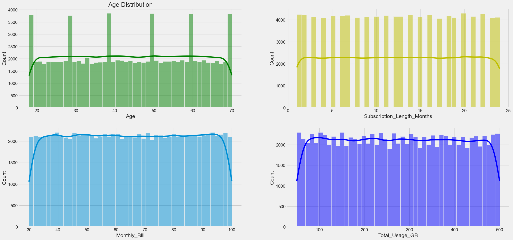
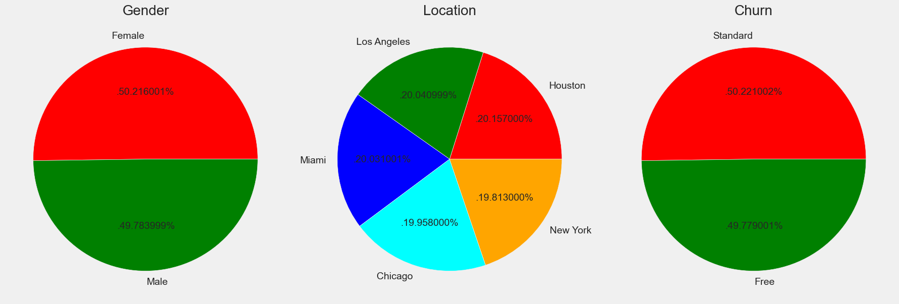
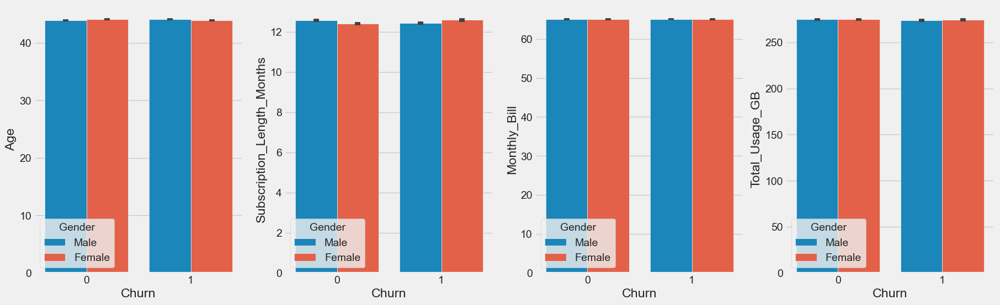

## Customer Churn Prediction using Machine Learning and Deep learning.

> #### Done ✅-> EDA✅ , Data Validation✅ , Model Training✅, Model Flow Tracking✅


## Data Insights:
- #### Numerical Data Points are equally distributed.

- #### Almost equally distribution of each class in each feature.

- #### With respect to churn
equal contribution of all classes



### Installation
1. Clone the repository:
   
```python
git clone https://github.com/GyanPrakashkushwaha/Customer-Churn-Prediction.git customer-churn-prediction
```

2. Navigate to the project directory:

```python
cd customer-churn-prediction
```
3. Create virtaul environment and activate it.
```python
virtalenv churnvenv 
churnvenv/Scipts/activate.ps1
```

3. Install the required dependencies:
```python
pip install -r requirements.txt
```
4. run main.py for `data validation` , `data transformation`, `model training` and `mlflow tracking`.
```Python
python run main.py
```  

5. Run the the streamlit app:
```python
streamlit run app.py
```

### MLflow 

- MLflow for local web server
```Python
mlflow ui
```

- run this in environment 
```bash
export MLFLOW_TRACKING_URI=https://dagshub.com/GyanPrakashKushwaha/Customer-Churn-Prediction.mlflow
export MLFLOW_TRACKING_USERNAME=GyanPrakashKushwaha 
export MLFLOW_TRACKING_PASSWORD=53950624aa84e08b2bd1dfb3c0778ff66c4e7d05
```
- Tracking URL
```Python
https://dagshub.com/GyanPrakashKushwaha/Customer-Churn-Prediction.mlflow
```

### **I TRIED MY BEST**😓
- For **model performance Improvement**(Data manipulation) `normalized` the features using `log normal distribution` but the performance didn't increase and then tried `Generated Data`  using `SMOTE` and then `trained model` in the large data but still the `accuracy` remained `same`.
- For **model performance Improvement** (Model training) Used `complex Algorithms` - `GradientBoostingClassifier` , `XGBoostClassifier` , `CatBoostClassifier` , `AdaBoostClassifier` , `RandomForestClassifier`
to easy algorithm like `Logistic Regession` and Also trained `Deep Neural Network` with different `weight Initializers` , `activation function` ,`input nodes` and `optimizer` but **models performance not Improved** 

- neural netwrok architecture
```Python
from keras.layers import BatchNormalization, Dense
from keras.losses import binary_crossentropy
from tensorflow import keras
from keras.callbacks import LearningRateScheduler
from keras.activations import relu , sigmoid
from keras import Sequential
from keras.initializers import he_normal

model = Sequential()

model = Sequential()

model.add(layer=Dense(units=512,activation=relu,kernel_initializer=he_normal))
model.add(layer=Dense(units=332,activation=relu,kernel_initializer=he_normal))
model.add(BatchNormalization())
model.add(Dense(units=128,activation=relu,kernel_initializer=he_normal))
model.add(Dense(units=64,activation=relu,kernel_initializer=he_normal))
model.add(Dense(units=1,activation=sigmoid,name='output_layer'))

def lr_schedule(epoch, lr):
    if epoch < 1:
        return lr
    else:
        return lr * np.exp(-0.1)

lr_scheduler = LearningRateScheduler(lr_schedule)

early_stopping = EarlyStopping(
    monitor="accuracy",
    min_delta=0.00001,
    patience=5,
    verbose=1,
    mode="auto",
    baseline=None,
    restore_best_weights=False
)

optimizer = keras.optimizers.RMSprop(learning_rate=0.0005)

model.compile(optimizer=optimizer, 
               loss=binary_crossentropy, 
                 metrics=['accuracy']) 

history = model.fit(X_train, y_train, validation_data=(X_test, y_test), epochs=20,
                    batch_size=64, 
                      callbacks=[lr_scheduler, early_stopping]) 
```
- Machine learning models and best parameters
```Python
{'Gradient Boosting Classifier': {'subsample': 0.7,
  'n_estimators': 64,
  'max_features': 'log2',
  'loss': 'exponential',
  'learning_rate': 0.1,
  'criterion': 'friedman_mse'},
 'XGBoost Classifier': {'subsample': 0.6,
  'n_estimators': 64,
  'min_child_weight': 1,
  'max_depth': 7,
  'learning_rate': 0.1},
 'CatBoost Classifier': {'loss_function': 'CrossEntropy',
  'learning_rate': 0.1,
  'iterations': 100,
  'eval_metric': 'Logloss',
  'depth': 8},
 'AdaBoost Classifier': {'n_estimators': 16,
  'learning_rate': 0.01,
  'algorithm': 'SAMME.R'},
 'Random Forest Classifier': {'n_estimators': 256,
  'min_samples_split': 10,
  'min_samples_leaf': 2,
  'max_features': 'sqrt',
  'max_depth': 40,
  'criterion': 'entropy'}}
```


## TODO
- read data from mondoDB 
- deploy the model in AWS